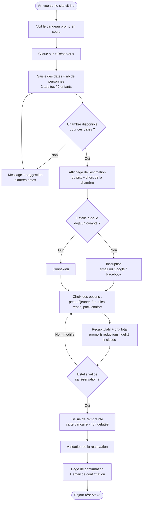

# User Flow — Réservation en ligne

> Persona : **Estelle Michaud**, 28 ans, cliente occasionnelle, à l'aise avec le numérique.
> Objectifs : réserver ses nuitées et son petit-déjeuner en ligne, être informée des promotions.
> Frustration à lever : ne pas pouvoir réserver directement ses nuitées et ses options.

Principe de conception : parcours court et fluide, promotion visible dès l'accueil,
options (petit-déjeuner, formules repas) proposées clairement avant le paiement.

## Étapes clés & attentes de la persona

| Étape | Ce qu'attend Estelle | Point de vigilance UX |
|---|---|---|
| Accueil | Repérer vite une bonne affaire | Bandeau promo visible immédiatement |
| Recherche | Voir dispo & prix sans friction | Estimation affichée tôt, avant le compte |
| Compte | Aller vite | Inscription sociale (Google/FB) pour éviter la saisie |
| Options | Ajouter petit-déjeuner facilement | Options présentées clairement, prix mis à jour en direct |
| Paiement | Être rassurée | Récap clair, empreinte CB expliquée (non débitée) |
| Confirmation | Preuve de réservation | Email immédiat + récap séjour |

## Points de friction à éviter (préparation étape 1.4)

- Obliger à créer un compte **avant** de voir les prix → décourage une cliente pressée.
- Cacher le prix total des options jusqu'à la fin → mauvaise surprise.
- Trop d'étapes ou de champs → Estelle cherche la rapidité et les bons plans.
