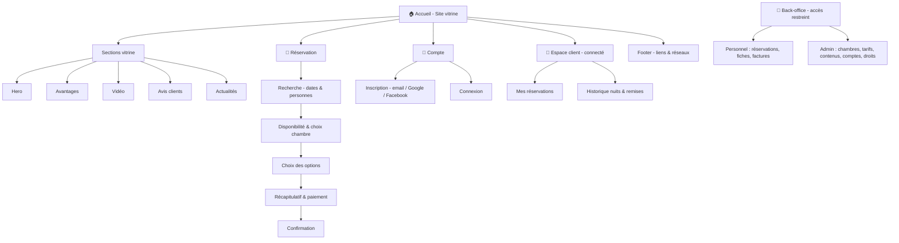

# Arborescence du site — Hôtel Artichaut

> Plan de site : les pages du site et la navigation entre elles.
> Vue d'ensemble qui cadre les wireframes (chaque page = un futur wireframe).
> Aligné sur le WBS client (`02b-wbs-client.md`).

## Lecture

- **Accueil (vitrine)** : point d'entrée public, avec le bandeau promo et les sections descriptives. Le bouton « Réserver » y est accessible en permanence.
- **Réservation** : parcours linéaire en 5 étapes (voir le user flow `04-userflow-reservation.md`).
- **Compte** : inscription/connexion, sollicité pendant la réservation (après l'affichage des prix).
- **Espace client** : accessible une fois connecté, pour suivre ses réservations.
- **Back-office** : zone séparée, réservée au Personnel et à l'Administrateur (hors parcours visiteur).

## Périmètre MVP (itération 1)

Pages à couvrir en priorité : **Accueil**, **Réservation (les 5 étapes)**, **Inscription / Connexion**.
Espace client et back-office : versions basiques ou itérations suivantes.
