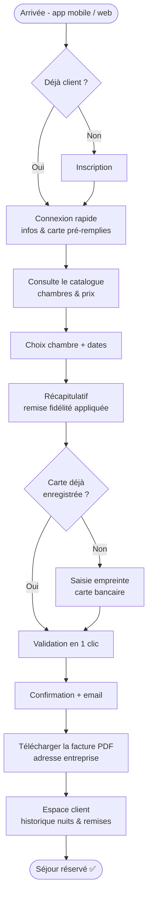

# User Flow — Client régulier (réservation express)

> Persona : **Michel Dublois**, 44 ans, commercial souvent en déplacement, client régulier.
> Objectifs : réserver une chambre en quelques clics, obtenir une facture dématérialisée.
> Frustrations à lever : ne pas voir facilement les chambres et les prix, site mal adapté au mobile,
> pas de conservation des données.

Principe de conception : parcours **rapide pour utilisateur connu**, données pré-remplies,
catalogue chambres/prix accessible d'emblée, facture PDF, expérience **mobile-first**.

## Ce que ce parcours apporte de nouveau (vs Estelle)

| Besoin de Michel | Traduction dans le parcours |
|---|---|
| Réserver en quelques clics | Chemin express : connexion → infos pré-remplies → validation 1 clic |
| Voir les chambres & prix facilement | Accès catalogue chambres/prix **avant** de lancer la réservation |
| Facture dématérialisée | Étape « Télécharger la facture PDF » + facturation à l'adresse entreprise |
| Pas de conservation des données | Profil persistant (données & carte mémorisées) + suivi fidélité |
| Site mal adapté au mobile | Conception **mobile-first** non négociable |
| Client régulier | Réductions fidélité (-10 % / -25 %) visibles et appliquées |

## Points de friction à éviter (préparation étape 1.4)

- Reproduire une saisie complète pour un client déjà connu → casse le « quelques clics ».
- Cacher le catalogue derrière un formulaire de dates → Michel veut d'abord *voir* l'offre.
- Facture difficile à retrouver → doit être accessible en 1 clic depuis la confirmation et l'espace client.
- Parcours non pensé pour le mobile → rédhibitoire pour un utilisateur en déplacement.

## Complémentarité des deux personae

- **Estelle** (occasionnelle) → parcours de découverte : promo visible, recherche par dates, options (petit-déjeuner). Voir `04-userflow-reservation.md`.
- **Michel** (régulier) → parcours d'efficacité : connexion rapide, rebooking express, facture pro, fidélité.

Les deux parcours partagent le même moteur (disponibilité, prix, réservation) mais divergent sur
l'entrée (découverte vs express) et la sortie (options/promo vs facture/fidélité).
