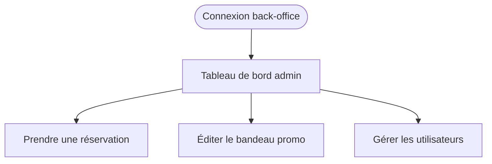
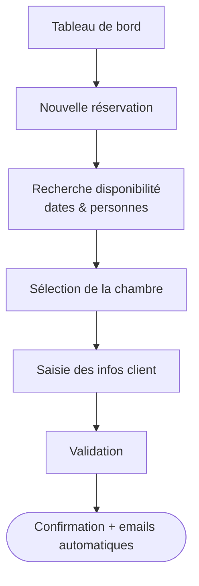
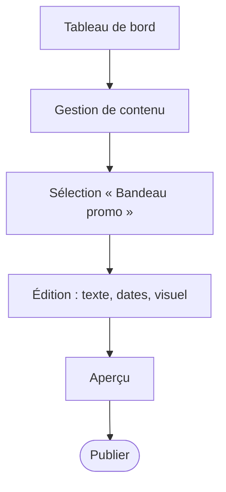
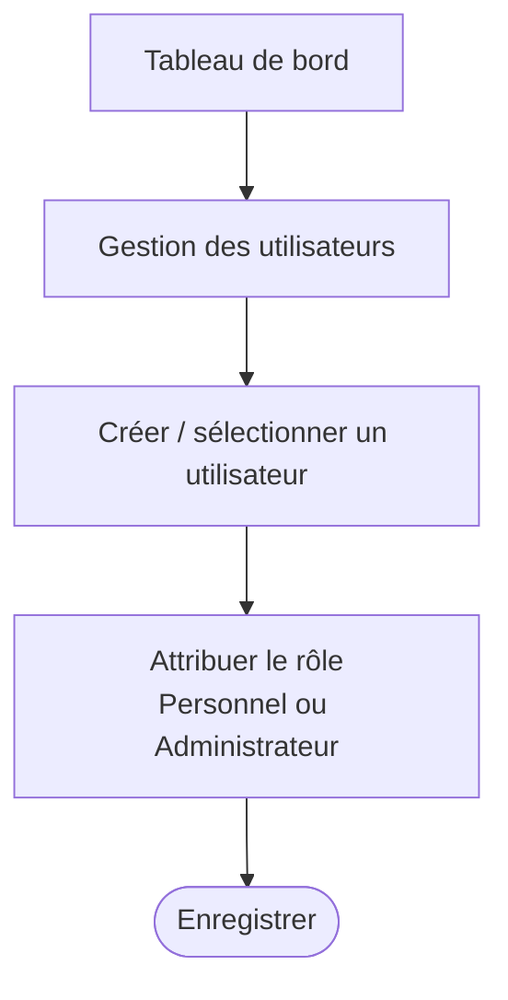

# User Flow — Directeur / Administrateur (back-office)

> Persona : **Robert Lame**, 51 ans, directeur de l'hôtel. Utilisateur interne (rôle Administrateur).
> Objectifs : prendre des réservations simplement, modifier le contenu du site (bandeau promo),
> gérer les utilisateurs et leurs droits.
> Frustrations à lever : processus de réservation peu moderne, tâches à automatiser, hôtel peu visible en ligne.

Principe de conception : back-office **responsive** (ordinateur, tablette, smartphone), tâches
d'administration **indépendantes** accessibles depuis un tableau de bord. Pas un long tunnel mais
plusieurs parcours courts.

## Point d'entrée commun

## Parcours 1 — Prendre une réservation (pour un client)

## Parcours 2 — Éditer le bandeau promo (CMS)

## Parcours 3 — Gérer un utilisateur & ses droits

## Besoins de Robert → traduction dans le parcours

| Besoin de Robert | Traduction dans le parcours |
|---|---|
| Prendre des réservations simplement | Parcours back-office de saisie rapide (dispo + infos client) |
| Modifier le contenu du site (bandeau promo) | Module CMS : édition → aperçu → publication |
| Gestion des utilisateurs (attribution des droits) | Écran d'attribution des rôles (Personnel / Administrateur) |
| Automatiser les tâches de réservation | Emails de confirmation automatiques, statuts mis à jour seuls |
| Hôtel peu visible sur internet | Site vitrine soigné, contenu à jour, bandeaux promo actifs |
| Utilise ordi, tablette et smartphone | Back-office **responsive** sur tous les appareils |

## Complémentarité des trois personae

- **Estelle** (cliente occasionnelle) → parcours de découverte : promo, recherche, options. Voir `04-userflow-reservation.md`.
- **Michel** (client régulier) → parcours d'efficacité : connexion rapide, rebooking express, facture. Voir `06-userflow-michel.md`.
- **Robert** (directeur / admin) → parcours d'administration : réservations internes, contenu, utilisateurs (ce document).

Les deux premiers sont **côté client** (site public), le troisième est **côté back-office** (interne).
