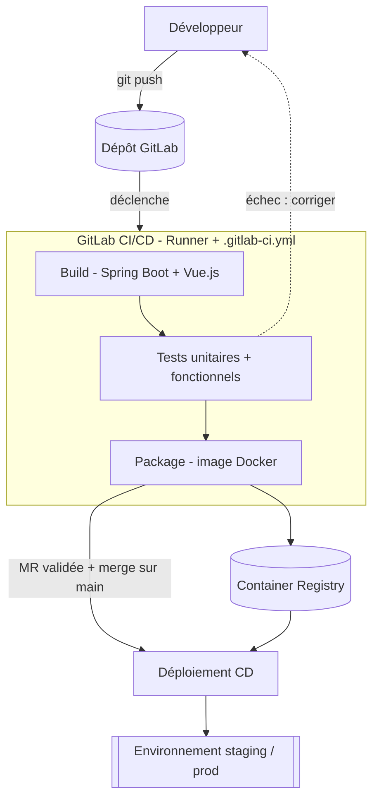

# Pipeline CI/CD — du push au déploiement

> Chaîne minimale déclenchée par un `git push` sur GitLab, jusqu'au déploiement (CD).

## Éléments qui interagissent

1. **Développeur** — `git push`
2. **Dépôt GitLab** — déclenche la pipeline
3. **`.gitlab-ci.yml` + Runner** — définit et exécute les étapes
4. **Build** — Spring Boot (back) + Vue.js (front)
5. **Tests** — unitaires + fonctionnels *(bloquant)*
6. **Package** — image Docker
7. **Container Registry** — stocke l'image
8. **Merge sur `main`** — déclenche le déploiement
9. **Déploiement (CD)** — met en ligne l'image
10. **Environnement** — staging / prod

## Diagramme

