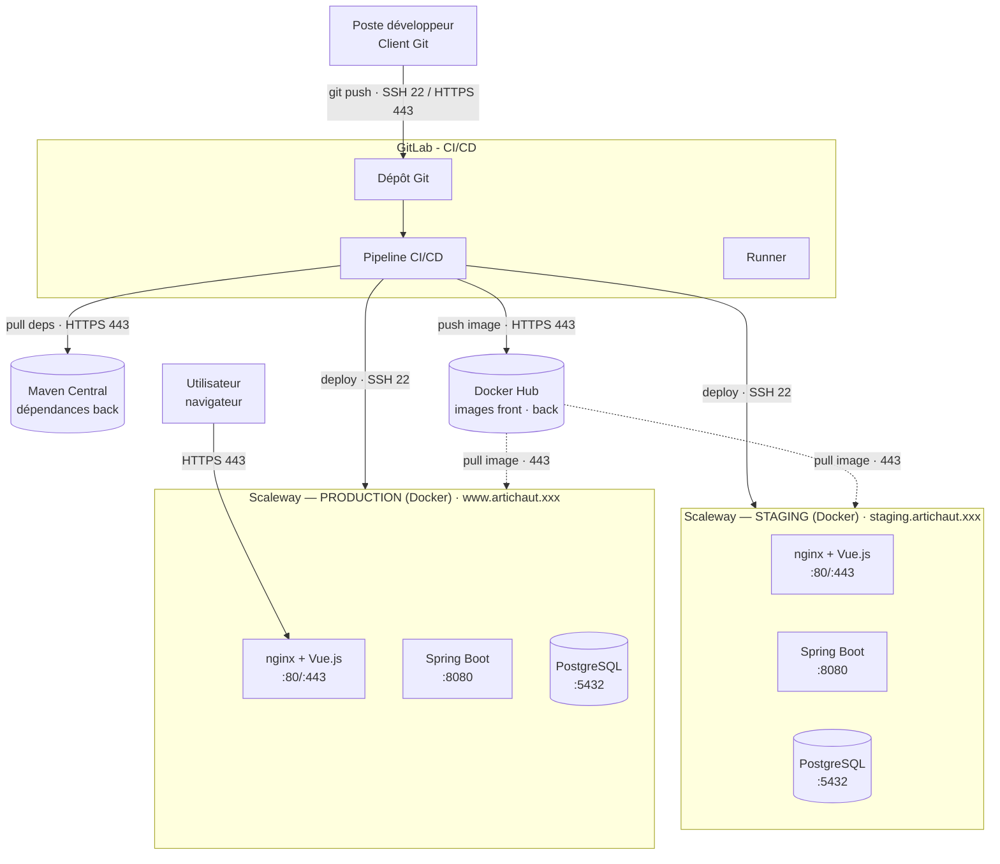

# Diagramme de déploiement — Hôtel Artichaut

> Livrable du module CI/CD (itération 1). Format UML de déploiement : **nœuds**, **composants** par nœud,
> **interconnexions** avec valeurs concrètes (ports, protocoles, hostnames).
> Doit faire apparaître : environnement **staging**, environnement **production**, outils **CI/CD**
> (GitLab + runners), **services externes** (Docker Hub, Maven Central).

## Nœuds & composants

| Nœud | Type | Composants | Accès |
|---|---|---|---|
| Poste développeur | Client | Client Git | — |
| GitLab | CI/CD | Dépôt Git, Pipeline CI/CD, Runner | HTTPS 443 / SSH 22 |
| Docker Hub | Service externe | Registre d'images (front, back) | HTTPS 443 |
| Maven Central | Service externe | Dépendances back-end | HTTPS 443 |
| Serveur Scaleway — Staging | Serveur Linux + Docker | nginx+Vue.js, Spring Boot, PostgreSQL | SSH 22 · domaine `staging.artichaut.xxx` |
| Serveur Scaleway — Production | Serveur Linux + Docker | nginx+Vue.js, Spring Boot, PostgreSQL | SSH 22 · domaine `www.artichaut.xxx` |
| Utilisateur | Client | Navigateur | HTTPS 443 |

> ⚠️ **À compléter avec les vraies valeurs** : IP des serveurs Scaleway (demander au formateur) et noms de domaine réels.

## Ports & protocoles des conteneurs

- **nginx (front Vue.js)** : 80 / 443 (HTTPS)
- **Spring Boot (back / API REST)** : 8080
- **PostgreSQL** : 5432 (interne au serveur)

## Diagramme

## Notes

- Les **secrets** (clé API Docker Hub, clés SSH de déploiement) sont stockés dans les variables protégées de **GitLab-CI**, jamais dans le code.
- Chaque serveur Scaleway exécute un **runtime Docker** ; les composants tournent en conteneurs isolés (idéalement orchestrés via **Docker Compose**).
- Les **noms de domaine** pointent vers les serveurs : sous-domaine `staging.` pour le test, domaine principal pour la prod, en **HTTPS (SSL)**.
- Prérequis serveurs : **accès SSH** (le formateur ajoute vos clés publiques au fichier `authorized_keys`).
