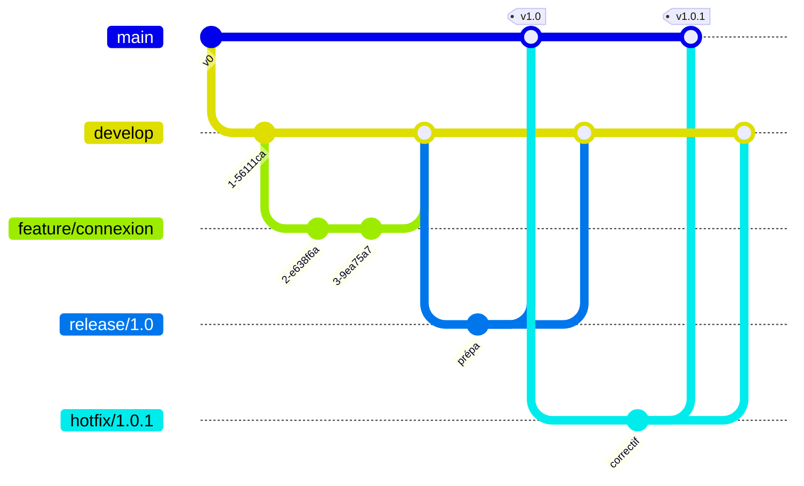

# Stratégie de branches — GitFlow

> Livrable du module CI/CD (itération 1). Comment l'équipe organise ses branches Git.

## L'idée

`main` est la **version officielle, toujours propre et déployable**. On n'écrit **jamais**
directement dessus. Chaque travail se fait sur une **branche dédiée**, puis est fusionné
après tests + relecture.

## Les branches de GitFlow

| Branche | Rôle | Créée depuis | Fusionnée dans |
|---|---|---|---|
| `main` | Version en production, toujours stable | — | — |
| `develop` | Branche d'intégration (le travail en cours de tous) | `main` | `main` (via release) |
| `feature/*` | Une nouvelle fonctionnalité | `develop` | `develop` |
| `release/*` | Préparation d'une version à livrer | `develop` | `main` **et** `develop` |
| `hotfix/*` | Correction urgente d'un bug en production | `main` | `main` **et** `develop` |

## Règles d'équipe

- **Une tâche = une branche `feature/`** (ex. `feature/CU-123-connexion`, avec l'ID de tâche ClickUp).
- On ne commit jamais directement sur `main` ni `develop` : on passe par une **Merge Request** (tests + relecture).
- `main` reste toujours déployable ; chaque version livrée y est **taguée** (`v1.0`, `v1.1`…).
- Un `hotfix` part de `main` pour corriger vite la prod, puis est reporté dans `develop`.

## Diagramme

## Version allégée (pour une équipe de 3)

GitFlow complet peut être lourd à 3. Une variante simple et fréquente : garder seulement
`main` + des branches `feature/*` (chaque feature fusionnée dans `main` après MR).
Comme le module demande explicitement **GitFlow**, présentez la version complète ci-dessus,
en mentionnant que vous l'adaptez si besoin.
