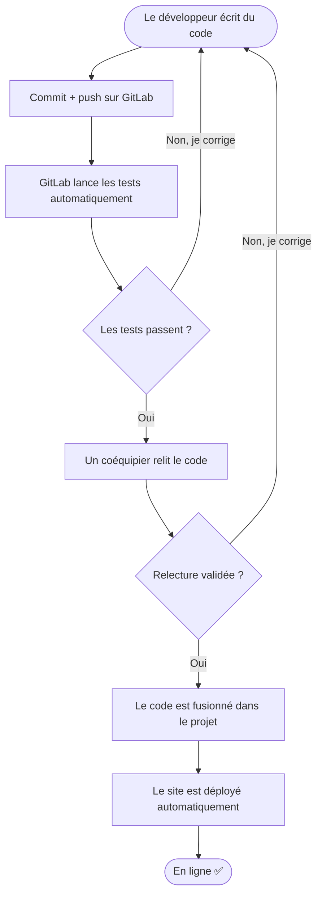

# Diagramme User Story — Que se passe-t-il quand je push du code ?

> Version simple. Point de vue du développeur, du commit jusqu'à la mise en ligne.

**En tant que développeur**, quand je termine un bout de travail, je le **commit** et je le **push**.
À partir de là, tout s'enchaîne :

1. **GitLab lance les tests automatiquement** (est-ce que le code fonctionne ?).
2. **Si les tests échouent** → je suis prévenu, je **corrige**, et je re-push.
3. **Si les tests passent** → un **coéquipier relit** mon code.
4. **S'il demande des changements** → je corrige et je re-push.
5. **S'il valide** → mon code est **fusionné** dans le projet.
6. Le **site est déployé automatiquement**. C'est en ligne. ✅

## Diagramme

## Les 2 idées à retenir

- **Rien n'est mis en ligne sans être testé et relu.** Les tests (la machine) + la relecture (un humain) sont deux filtres de sécurité.
- **Le déploiement est automatique** une fois ces deux filtres passés : plus besoin de le faire à la main.
